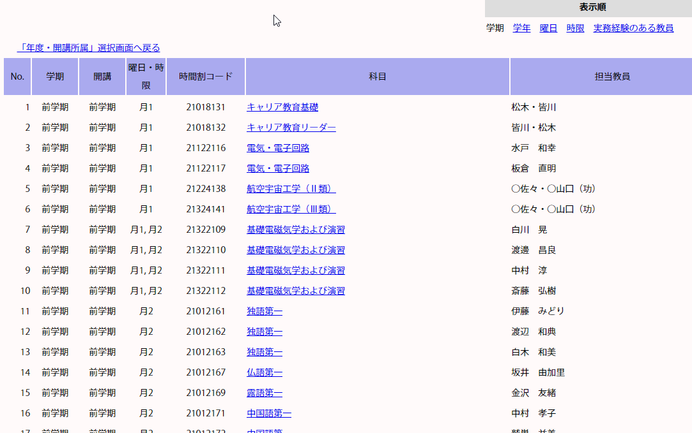

# ご注文は休講情報ですか？

## 依存関係のインストール
```sh
sudo apt install pandoc
pip3 install pymongo bs4 requests pyyaml greenlet
CFLAGS="-I<parent dir of greenlet installed path>" UWSGI_PROFILE="asyncio" pip3 install uwsgi
```

## 起動
* Access TokenとChannel Secretは環境変数に設定する
```sh
make run
```
## リロード
```sh
make reload
```
## IO

```
LINE Botと友だちになる -> LINE Notifyと連携 
                     -> アップロードリンクからCSVをアップロード 
                     
-> やり取りはLINE Botと、こちらから送るのはLINE Notify
```


## リポジトリ構成
* uec-world-dominators/kyukou-bot
* <自分のid>/kyukou-bot (forked)\
各自こっちで編集、できたら上のリポジトリにプルリクエスト
1. https://github.com/uec-world-dominators/kyukou-bot にアクセスして自分のアカウントにForkする
2. 自分のアカウント内の「kyukou-bot」リポジトリをCloneする
3. `git remote add upstream https://github.com/uec-world-dominators/kyukou-bot`をターミナルで実行する
4. 編集する
5. vscodeなりターミナルなりでコミットする
6. pushする
7. ある程度できたらgithub.comからuec-world-dominators/kyukou-bot devブランチ宛にプルリクエストをさくせいする
8. みんながチェックして良かったらマージする

```sh
# 上位のリポジトリを設定
git remote add upstream https://github.com/uec-world-dominators/kyukou-bot
# そこから他の人が変更したものを取ってくる
git fetch upstream dev
# 自分の変更と競合しないように合体する
git merge upstream/dev
```

# 各プラットフォーム紹介文
## LINE
### ご注文は休講情報ですか？[電通大]
電気通信大学の休講情報ボットです。履修登録のCSVファイルをアップロードすることで、一人ひとりに合わせた休講情報を配信します。（非公式）
#### ステータスメッセージ
電通大の個別配信型 休講情報ボットです
## Twitter
### ご注文は休講情報ですか？[電通大]
電気通信大学の休講情報をお届けします。DMから履修登録のCSVファイルをアップロードすることで、一人ひとりに合わせた休講情報を配信します。ツイートではすべての休講情報をつぶやきます。（非公式）


# Twitter API申請
私は大学生です。学校が休講情報をウェブページ上にアップロードしますが、自分が履修している講義に関する情報を探すのは面倒です。Twitter APIを使用してその人が履修する講義だけを通知するアプリケーションを作成し、皆の大学生活を便利にしようと思います。
Twitterのダイレクトメッセージを使用して、各個人が履修する講義を、このアプリケーションに登録し、パーソナライズされた休講情報を提供しようと考えています。

# GoogleOAuth確認
このアプリケーションは大学の休講情報をユーザーに個別に配信し、ユーザーの大学生活のエクスペリエンスを向上させることを目的としています。この配信する機能に加えて、ユーザーのGoogleカレンダーにも表示させることで、ユーザーは日々の予定を立てやすくなります。アプリは https://www.googleapis.com/auth/calendar.events を使用してユーザーのGoogleカレンダーに大学の休講情報に関するイベントを作成し、ユーザーの便利な生活を推進します。


# メンテナンス

1. cloneしてくる

```sh
git clone https://github.com/shosatojp/wd-kyukou-bot.git
```

1. シラバス情報をsyllabus以下にダウンロードする



このページ

1. コンテナを起動する

1. シラバスをDBに登録する

```
sudo docker-compose exec kyukoubot bash
cd wd-kyukou-bot/kyukou
python3 syllabus.py
exit
```

1. Twitterのトークンを取得する

```
https://kyukou.monoid.app/api/v1/twitter/redirect_url?consumer_key_secret=&consumer_key=
```